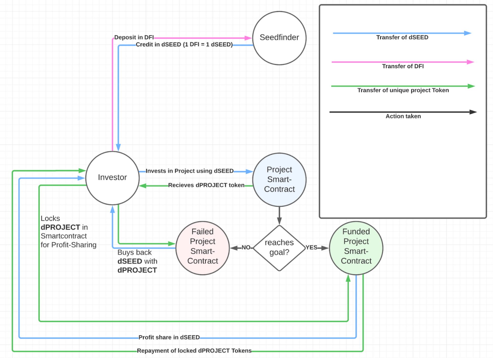

# DEFI SEEDFINDER PROTOCOL

The DeFi SeedFinder offers investors on DeFiChain the opportunity to invest in projects within the DFC ecosystem in a secure, transparent and completely self-sufficient manner.

## Workflow and Tokenomics

DeFi-Seedfinder will be a standalone, non-profit company that will have its own ERC-20 based Utility Token. The Utility Token (hereafter referred to as dSEED) can be exchanged by investors for DFI at any time on a 1:1 basis.

With these dSEED tokens, investors are able to invest in projects by exchanging dSEED tokens in the amount of their desired investment for corresponding project tokens (dProject). For each project, a unique token is created, limited to 10,000 units, whose price is directly correlated to the requested funding amount in dollars and is not subject to fluctuations during the funding phase.

Entrepreneurs collect dSEED tokens during their funding phase, which are aggregated into their corresponding, project-specific smart contract. If the company has reached its funding goal after the deadline (and thus all project tokens have been distributed), the applicant will automatically receive the dSEED tokens paid out by the smart contract. These dSEED tokens can then be exchanged for DFI piece by piece at DeFi-Seedfinder, taking into account the pre-agreed milestones and associated payout stages.
In case the funding goal is not reached after the deadline, all project token holders can exchange their project tokens back for dSEED in the original ratio.

If the financed company generates a profit in FIAT and has committed to a dividend / profit distribution, it must invest the corresponding profits in DFI, buy the utility token dSEED with these DFI and deposit them in the smart contract. Each project token holder then has the option of locking its project tokens in the smart contract for the distribution period and transferring them to its wallet after the distribution, including the dividends / profits in the form of dSEED.

### Creating a financing request


### Investing into a project



## Devolepment and Testing Smart Contracts

Try running some of the following tasks:

```shell
npx hardhat help
npx hardhat test
REPORT_GAS=true npx hardhat test
npx hardhat node
npx hardhat run scripts/deploy.js
```
